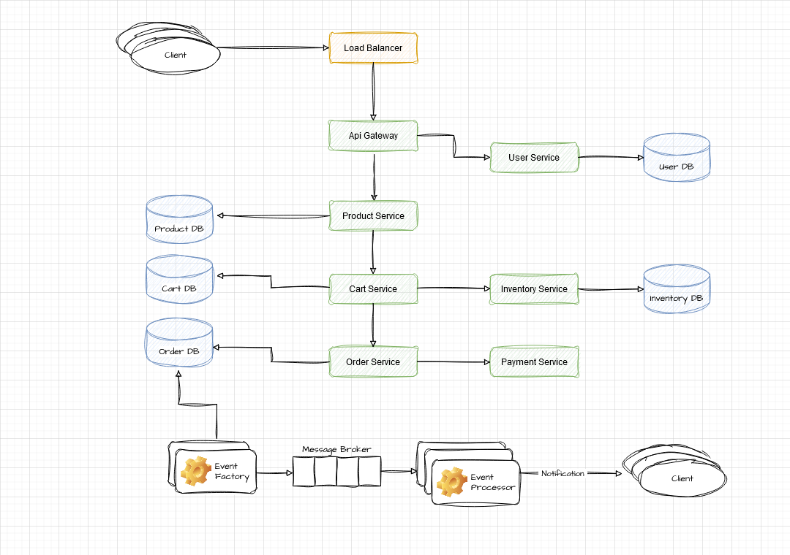

# ecomm-platform

## Description
A simple application simulating basic online shopping system, where users can browse products, add them to their shopping carts, and place orders. At the end of each month application sends an email to 
customers with a list of all of their transactions as a PDF.

## Feature
Provided solution is just a shell of the application with a high-level design and architecture of the application, demonstrating how the components interact and communicate.

All data repositories are mocked.
Functionality implementoed only in **Product**, **Cart** and **Inventory** services.\
**Cart** service may be used as an entry point for testing purposes.

**Component Diagram: The Structural Overview**

